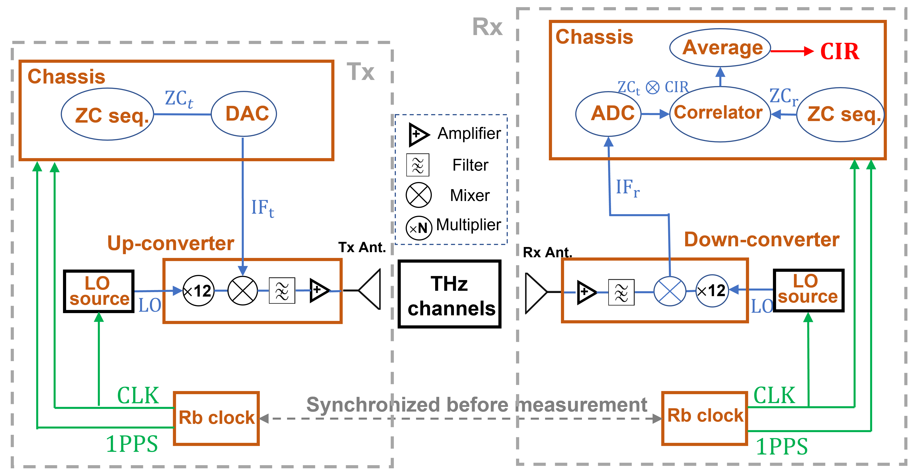

# 学习笔记 02.17

学习内容: Correlation-based Dual-band THz Channel Measurements and Characterization

## 1. 测量设备的使用原理

发送端：

- 生成ZC序列，通过DAC转换为模拟信号并上变频至12 GHz的中频。
- 之后通过本地振荡器混频得到THz信号，并经过滤波和放大后由天线发射。

接收端：

- 接收信号后，经过放大、滤波、下变频、模数转换（ADC），最终解码得到通道脉冲响应（CIR）]

## 2. 测量方法

室内测量（实验室环境）

室外测量（校园街道）

- 测量位置
  - 发射机（Tx）固定，依次调整接收机的位置
- 测量流程
  - **角度扫描测量**（DSS）：接收机天线进行**方位角（0°–360°）和仰角（-20°–20°）旋转**，步长10°，每个Rx点测量180个CIR。
  - **时钟同步**：Tx与Rx使用铷（Rb）钟进行时钟同步，测量前进行1.5小时的主从同步。
  - **测量时间**：每个Rx点测量约20分钟，共收集**3600个CIR数据**。

## 3. 数据预处理

**校准（Calibration）**：

- 先进行**直连测量**，获得系统响应，再从实际测量数据中去除系统响应。

1. **时间漂移修正**：

- $$Δτ(t)=\frac{(t - t_i)(\Delta\tau_j - \Delta\tau_i)}{t_j - t_i} + \Delta\tau_j$$
  - 其中$$\Delta\tau$$表示时间漂移，$$t$$为测量时间。

2. **传递函数修正**

- $$H=\frac{S^{measure}_{21}}{S^{extra}_{21}S^{connect}_{21}}$$

其中：**真实测量（$$S^{measure}_{21}$$）**：Tx 和 Rx 处于实验环境中，测得的 S 参数包括信道信息以及测量设备的影响

​    **直接连接测量（$$S^{connect}_{21}$$）**：将 Tx 和 Rx 直接连接（去掉自由空间传输部分），仅测量测量系统的影响。

​    $$S^{extra}_{21}$$ 代表由于不同测量设置（如天线、放大器）导致的系统误差。

**信道估计（Channel Estimation）**：

- 计算**多径分量（MPC）**的参数，并通过聚类算法提取主要传播簇（clusters）。

## 4. 数据分析

1. 路径损耗和阴影衰落：分析 THz 信号在不同 Tx-Rx 位置的衰减情况，并评估阴影衰落的影响。

   方法：

2. K因子：评估 THz 信道中 **LoS 成分** 相对于其他多径成分的主导程度。

3. 时延：分析 THz 信道中功率在时间和空间域的分布情况。

4. Cluster参数